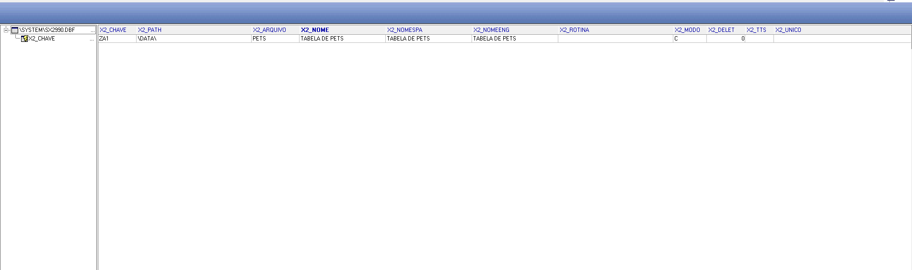
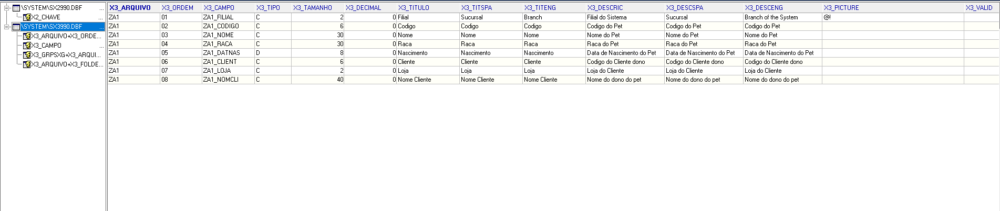
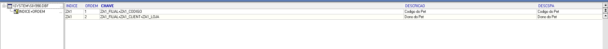

# Exercício 2 — Completando a tabela ZA1 (Pets)

## Objetivo

O objetivo deste exercício foi completar a tabela **ZA1 (Pets)**, adicionando o relacionamento entre o pet e seu dono.

Foi criado um vínculo com a tabela de clientes **SA1**, permitindo identificar qual cliente é responsável pelo animal cadastrado.

---

# 1. Estrutura da tabela ZA1 - SX2

A **SX2** representa o cadastro das tabelas no dicionário de dados do Protheus.

A tabela criada foi:

**ZA1 - Pets**

Essa tabela é responsável por armazenar as informações dos pets cadastrados.

Principais campos da tabela:

- **ZA1_FILIAL**: Filial do registro.
- **ZA1_COD**: Código identificador do pet.
- **ZA1_NOME**: Nome do pet.
- **ZA1_RACA**: Raça do animal.
- **ZA1_DTNASC**: Data de nascimento.
- **ZA1_CLIENT**: Código do cliente dono do pet.
- **ZA1_LOJA**: Loja do cliente dono do pet.

### Print da SX2:



---

# 2. Campos da tabela ZA1 - SX3

A **SX3** contém a definição dos campos pertencentes às tabelas do Protheus.

Foi criado o campo:

## ZA1_NOMCLI

Esse campo representa o nome do cliente responsável pelo pet.

Configurações utilizadas:

- **Campo:** ZA1_NOMCLI
- **Tipo:** Caracter
- **Contexto:** Virtual

O campo foi definido como virtual pois o valor não é armazenado diretamente na tabela ZA1. O nome do cliente é buscado através de uma relação com a tabela de clientes **SA1**.

---

## Relação do campo ZA1_NOMCLI

Para realizar a busca do nome do cliente foi utilizada a seguinte expressão:

```advpl
POSICIONE("SA1",1,xFilial("SA1")+M->ZA1_CLIENT+M->ZA1_LOJA,"A1_NOME")
```

Essa relação utiliza:

- **ZA1_CLIENT** → Código do cliente.
- **ZA1_LOJA** → Loja do cliente.
- **A1_NOME** → Nome do cliente retornado da tabela SA1.

---

### Print da SX3:



---

# 3. Índices da tabela ZA1 - SIX

A **SIX** é responsável pelo cadastro dos índices das tabelas do Protheus.

Os índices permitem melhorar a organização e velocidade de busca dos registros.

Foram utilizados os seguintes índices:

---

## Índice 1 - Código do Pet

Chave:

```
ZA1_FILIAL+ZA1_COD
```

Esse índice permite localizar um pet através do seu código de identificação.

---

## Índice 2 - Dono do Pet

Chave:

```
ZA1_FILIAL+ZA1_CLIENT+ZA1_LOJA
```

Esse índice permite localizar os pets relacionados a determinado cliente.

---

### Print da SIX:



---

# Conclusão

Após as alterações realizadas, a tabela **ZA1 (Pets)** passou a possuir um relacionamento com a tabela **SA1 (Clientes)**.

O campo virtual **ZA1_NOMCLI** permite visualizar o nome do dono do pet sem a necessidade de duplicar essa informação dentro da tabela ZA1.

Além disso, os índices cadastrados na **SIX** auxiliam na organização e na busca dos registros da tabela.